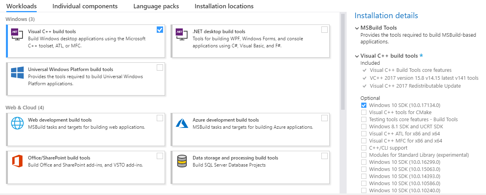

## Windows prerequisites

### Rust

On Windows, the Rust compiler needs the Visual C++ Build tools:

Download the [Microsoft Visual C++ Build Tools](https://visualstudio.microsoft.com/thank-you-downloading-visual-studio/?sku=BuildTools).

When installing, choose "Visual C++ build tools" in the "Workloads" tab.
Also tick the optional feature "Windows SDK":



Install [Rust](https://win.rustup.rs/).


### OpenSSL

Go to https://slproweb.com/products/Win32OpenSSL.html and download `Win64 OpenSSL v1.x.x` or `Win32 OpenSSL v1.x.x` depending on your architecture.

Run the installation and set the installation path that you chose as an `OPENSSL_DIR` environment variable.

### Languages

You can support different optional languages:

#### C/C++

Go to https://osdn.net/projects/mingw/releases/, expand the "MinGW Installation Manager (mingw-get)" category.

Download "mingw-get-setup.exe" and run the installation.
Add your `MinGW\bin` installation directory to your `Path` environment variable (if you installed MinGW in `C:\MinGW` for example, add `C:\MinGW\bin` to your Path variable).

Open a new `cmd` window.
Run `mingw-get` to install the compilers:
```cmd
C:\Users\Rustacean>mingw-get install gcc g++
```
Check if they are working properly:
```cmd
C:\Users\Rustacean>g++ --version
g++ (MinGW.org GCC-6.3.0-1) 6.3.0
...

C:\Users\Rustacean>gcc --version
gcc (MinGW.org GCC-6.3.0-1) 6.3.0
...
```

#### PHP

Download and install [the latest supported Visual C runtime redistributable](https://support.microsoft.com/en-us/help/2977003) (`vc_redist.x86.exe` or `vc_redist.x64.exe`).

Go to https://windows.php.net/download.

Download the `VCxx x64 Thread Safe` archive if you chose the `vc_redist.x64.exe` or the `VCxx x86 Thread Safe` archive otherwise.

Extract the contents of the archive and add the resulting directory to your `Path` environment variable.

Open a new `cmd` window and check if the PHP interpreter is working properly:
```cmd
C:\Users\Rustacean>php --version
PHP 7.3.0 (cli) (built: Dec  6 2018 01:54:16) ( NTS MSVC15 (Visual C++ 2017) x64 )
...
```

#### Python

Go to https://www.python.org/downloads/windows/.

Click on `Latest Python 3 Release - Python 3.x.x`.

Scroll down to the "Files" section and download the `Windows x86-64 executable installer` version or the `Windows x86 executable installer` based on your system architecture.

Run the executable, and make sure to tick the "Add Python 3.x to PATH".

Open a new `cmd` window and check if the Python interpreter is working properly:
```cmd
C:\Users\Rustacean>python --version
Python 3.7.1
```

#### JavaScript

Go to https://nodejs.org/en/download/, download the `Windows Installer (.msi)` and run the installation.

While installing, make sure you keep the "Add to PATH" option.

Open a new `cmd` window and check if nodejs is working properly:
```cmd
C:\Users\Rustacean>node --version
v10.14.1
```

#### C#

In the Windows Start Menu search bar, type "Visual Studio Installer" and run it (you should have it installed since you installed the build tools in the first section).

Click on the "Modify" button.

Check the "Visual Studio extension development" workload.

Open the "Visual Studio extension development" node in the summary tree on the right.

Check the box for ".NET Compiler Platform SDK". You'll find it last under the optional components.

You need to add the directory that contains the compiler to your `Path` environment variable:
For example `C:\Program Files (x86)\Microsoft Visual Studio\2017\BuildTools\MSBuild\15.0\Bin\Roslyn` (replace `2017` and `15.0` with your installed version).

Open a new `cmd` window and check if the compiler is working properly:
```cmd
C:\Users\Rustacean>csc /version
2.10.0.0 (b9fb1610)
```
